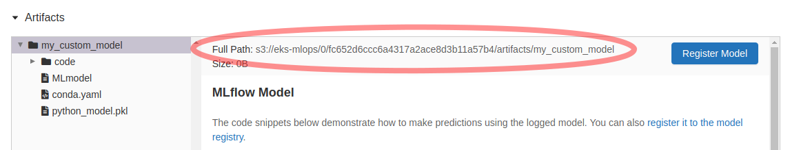

Seldon usage
============

.. contents::

Deploying a model logged in MLFlow
----------------------------------

.. rubric:: Get model URI

You'll need the URI of the model logged in MLFlow. Generally, this URI is of form::

    <MLFlow_artifact_root>/<experiment_id>/<run_id>/artifacts/<model_artifact_name>

You can get it e.g. from MLFlow UI - go to
your experiment run and check in the Artifacts section:

You can also get it with::

    with mlflow.start_run() as run:
        # Do everything related to training a model...
        mlflow.[sklearn/pyfunc/*].log_model("my_custom_model", ...)
        model_uri = mlflow.get_artifact_uri("my_custom_model")

.. rubric:: Create the deployment

Create a resource like this one in the cluster. Make sure to replace ``<DEPLOYMENT_NAME>`` and ``<YOUR_MODEL_URI>``::

    apiVersion: machinelearning.seldon.io/v1alpha2
    kind: SeldonDeployment
    metadata:
      name: <DEPLOYMENT_NAME>
    spec:
      predictors:
      - name: predictor
        graph:
          children: []
          implementation: MLFLOW_SERVER
          modelUri: <YOUR_MODEL_URI>
          name: prediction
        replicas: 1
        traffic: 100
        componentSpecs:
        - spec:
            # We are setting high failureThreshold as installing conda dependencies
            # can take long time and we want to avoid k8s killing the container prematurely
            containers:
            - name: prediction
              livenessProbe:
                initialDelaySeconds: 60
                failureThreshold: 100
                periodSeconds: 5
                successThreshold: 1
                httpGet:
                  path: /health/ping
                  port: http
                  scheme: HTTP
              readinessProbe:
                initialDelaySeconds: 60
                failureThreshold: 100
                periodSeconds: 5
                successThreshold: 1
                httpGet:
                  path: /health/ping
                  port: http
                  scheme: HTTP

An example of doing it programmatically can be found `here <https://github.com/MLOps-architecture/wine_classifier/blob/main/wine_classifier/pipelines/deployment_pipeline.py>`__.

Using prediction endpoint
-------------------------

When a SeldonDeployment is created, Seldon instructs Ambassador to create a public endpoint that points to the deployed model's pod. The URL of the deployment is of the form::

    <Ambassador_public_URL>/seldon/seldon/<Seldon_deployment_name>/api/v0.1/predictions

The API version string in the above URL doesn't seem to play a role. It works even if you replace
it with other version.

An example CURL command to hit the endpoint is::

    curl -v my_mlops.com/seldon/seldon/my_seldon_deployment/api/v0.1/predictions -H "Content-Type: application/json" -d '{"data":{"ndarray":[[0]]}}'

Documentation is `here <https://docs.seldon.io/projects/seldon-core/en/v0.2.7/graph/ambassador.html>`__.

Different Rollout Strategies
----------------------------
Canary Rollouts
^^^^^^^^^^^^^^^
Canary rollouts are available where you wish to push a certain percentage of traffic to a new model to test whether it works ok in production. You simply need to add some annotations to your Seldon Deployment resource for your canary deployment.

- | ``seldon.io/ambassador-weight:<weight_value>``: The weight (a value between 0 and 100) to be applied to this deployment.
  | Example: ``"seldon.io/ambassador-weight":"25"``
- | ``seldon.io/ambassador-service-name:<existing_deployment_name>``: The name of the existing Seldon Deployment you want to attach to as a canary.
  | Example: ``"seldon.io/ambassador-service-name":"example"``

Here is an example for `canary deployments <https://docs.seldon.io/projects/seldon-core/en/v0.2.7/examples/ambassador_canary.html>`_.

Shadow Deployments
^^^^^^^^^^^^^^^^^^
Shadow deployments allow you to send duplicate requests to a parallel deployment but throw away the response. This allows you to test machine learning models under load and compare the results to the live deployment.

You simply need to add some annotations to your Seldon Deployment resource for your shadow deployment.

- ``seldon.io/ambassador-shadow:true``: Flag to mark this deployment as a Shadow deployment in Ambassador.
- | ``seldon.io/ambassador-service-name:<existing_deployment_name>``: The name of the existing Seldon Deployment you want to attach to as a shadow.
  | Example: ``"seldon.io/ambassador-service-name":"example"``

Here is an example for `shadow deployments <https://docs.seldon.io/projects/seldon-core/en/v0.2.7/examples/ambassador_shadow.html>`_.

# TODO: Copy the rest from internal Confluence.
