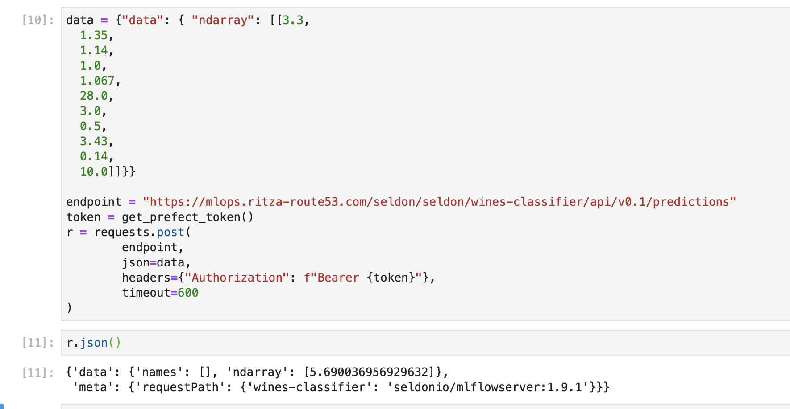
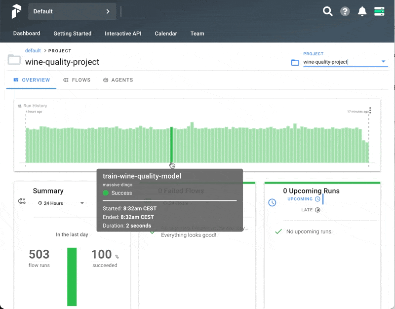

# Deploying a model to production with Prefect and Seldon

In the [previous tutorial](https://github.com/datarevenue-berlin/OpenMLOps/blob/master/tutorials/basic-usage-of-jupyter-mlflow-and-prefect.md) we built a basic machine learning model to predict the quality of wines. We set up a Prefect flow to automatically retrain this model regularly, and save the updated model to S3, while recording all of the results in MLFlow.

In this tutorial, we'll deploy that same model to a production REST API using Seldon. You can follow this guide without completing the previous one, as we will summarize the model training steps before deploying it. If you have your own model saved in S3 that you want to deploy, you can use that instead.

## Result of following this guide 

Once you've set everything up, you'll have your model deployed behind a REST API. You'll be able to pass metrics of an individual wine and get back a predicted quality rating, e.g. using `curl` or `requests`.



## Writing the training and deployment code

We'll use Jupyter Hub again for writing code. Create a cell with the following imports.

```python
from prefect import task, Flow, Parameter, Client
from prefect.run_configs import KubernetesRun
from prefect.schedules import IntervalSchedule
from prefect.storage import S3

from sklearn.metrics import mean_squared_error, mean_absolute_error, r2_score
from sklearn.model_selection import train_test_split
from sklearn.linear_model import ElasticNet

from datetime import timedelta

import numpy as np
import pandas as pd

import mlflow
import requests
```

This imports the modules we need from `prefect` (to set up the flows), from `sklearn` (to train the model) and `mlflow` (to track the results). We'll also use `requests` to get our data and test our deployed model, `datetime` to set up the training schedule, as well as `numpy` and `pandas` for some utility functions.

In a second cell, add the following code

```python
@task
def fetch_data():
    csv_url = "http://archive.ics.uci.edu/ml/machine-learning-databases/wine-quality/winequality-red.csv"
    data = pd.read_csv(csv_url, sep=";")
    return data


def eval_metrics(actual, pred):
    rmse = np.sqrt(mean_squared_error(actual, pred))
    mae = mean_absolute_error(actual, pred)
    r2 = r2_score(actual, pred)
    return rmse, mae, r2


@task
def train_model(data, mlflow_experiment_id, alpha=0.5, l1_ratio=0.5):
    mlflow.set_tracking_uri("http://mlflow.mlflow:5000")

    train, test = train_test_split(data)

    # The predicted column is "quality" which is a scalar from [3, 9]
    train_x = train.drop(["quality"], axis=1)
    test_x = test.drop(["quality"], axis=1)
    train_y = train[["quality"]]
    test_y = test[["quality"]]

    s = """channels:
- defaults
- conda-forge
dependencies:
- python=3.7.9
- pip
- pip:
  - mlflow
  - scikit-learn==0.24.1
  - seldon-core==1.6.0
  - cloudpickle==1.6.0
name: mlflow-env"""

    with open("conda.yaml", "w") as f:
        f.write(s)

    with mlflow.start_run(experiment_id=mlflow_experiment_id):
        lr = ElasticNet(alpha=alpha, l1_ratio=l1_ratio, random_state=42)
        lr.fit(train_x, train_y)
        predicted_qualities = lr.predict(test_x)
        (rmse, mae, r2) = eval_metrics(test_y, predicted_qualities)

        print("Elasticnet model (alpha=%f, l1_ratio=%f):" % (alpha, l1_ratio))
        print("  RMSE: %s" % rmse)
        print("  MAE: %s" % mae)
        print("  R2: %s" % r2)

        mlflow.log_param("alpha", alpha)
        mlflow.log_param("l1_ratio", l1_ratio)
        mlflow.log_metric("rmse", rmse)
        mlflow.log_metric("r2", r2)
        mlflow.log_metric("mae", mae)

        mlflow.sklearn.log_model(lr, "model", conda_env="conda.yaml")
```

This is very similar to the code we used to train the model in the previous tutorial, but we specify a list of dependencies and versions in a conda.yaml file. These will be saved with the model in MLFLow, and used by Seldon when running the model too.

In a third cell, add the following code, substituting the domain and credential variables for your own.

```python
domain = "mlops.example.com"  # the domain where you are hosting Open MLOps
username = "user@example.com"  # the username you used to register on Open MLOps
password = "yourstrongpassword"  # the password you used to register on Open MLOps
s3_bucket = "your-s3-bucket"  # the S3 bucket you specified when setting up Open MLOps

prefect_project_name = "wine-quality-project"  # you can use what you want here
docker_image = "drtools/prefect:wine-classifier-3"  # any docker image that has the required Python dependencies

auth_url = f"https://{domain}/.ory/kratos/public/self-service/login/api"
prefect_url = f"https://prefect.{domain}/graphql"

def get_prefect_token():
    r = requests.get(auth_url)
    jsn = r.json()
    action_url = jsn["ui"]["action"]
    data = {"identifier": username, "password": password}
    headers = {"Accept": "application/json", "Content-Type": "application/json"}
    r = requests.post(action_url, json=data, headers=headers)
    jsn = r.json()
    session_token = jsn["session_token"]
    return session_token


get_prefect_token()
```

This allows us to get a session token that we will use to authenticate with Prefect and Seldon.

Finally, create the Prefect flow to train the model with the following code.

```python
def create_prefect_flow():
    run_config = KubernetesRun(
        labels=["dev"],
        service_account_name="prefect-server-serviceaccount",
        image=docker_image,
    )
    storage = S3(s3_bucket)

    session_token = get_prefect_token()
    prefect_client = Client(api_server=prefect_url, api_token=session_token)
    schedule = IntervalSchedule(interval=timedelta(minutes=2))

    with Flow(
        "train-wine-quality-model", schedule, storage=storage, run_config=run_config
    ) as flow:
        data = fetch_data()
        train_model(data=data, mlflow_experiment_id=1, alpha=0.3, l1_ratio=0.3)

    prefect_client.create_project(project_name=prefect_project_name)
    training_flow_id = prefect_client.register(flow, project_name=prefect_project_name)
    flow_run_id = prefect_client.create_flow_run(
        flow_id=training_flow_id, run_name=f"run {prefect_project_name}"
    )
```

## Creating the configuration for deploying to Seldon

Seldon uses YAML to configure various deployment options. The following looks complicated if you are not used to YAML, but you can ignore most of it as it simply sets up some reasonable defaults. You can change the `name: wines-classifier` lines to something that better fits your specific model (as this will be used in the final end point URL as well)>

```python
environment = "seldon"

import yaml
import prefect
from prefect import task
from kubernetes import client, config

seldon_deployment = """
    apiVersion: machinelearning.seldon.io/v1alpha2
    kind: SeldonDeployment
    metadata:
      name: wines-classifier
      namespace: seldon
    spec:
      predictors:
      - graph:
          children: []
          implementation: MLFLOW_SERVER
          modelUri: dummy
          name: wines-classifier
        name: model-a
        replicas: 1
        traffic: 100
        componentSpecs:
        - spec:
            # We are setting high failureThreshold as installing conda dependencies
            # can take long time and we want to avoid k8s killing the container prematurely
            containers:
            - name: wines-classifier
              livenessProbe:
                initialDelaySeconds: 60
                failureThreshold: 100
                periodSeconds: 5
                successThreshold: 1
                httpGet:
                  path: /health/ping
                  port: http
                  scheme: HTTP
              readinessProbe:
                initialDelaySeconds: 60
                failureThreshold: 100
                periodSeconds: 5
                successThreshold: 1
                httpGet:
                  path: /health/ping
                  port: http
                  scheme: HTTP
"""

CUSTOM_RESOURCE_INFO = dict(
    group="machinelearning.seldon.io",
    version="v1alpha2",
    plural="seldondeployments",
)
```

## Creating the model deployment task

We want to use Prefect to deploy our model too so that we can easily track deployments, and even automate these as part of our other flows if we want a fully automated end-to-end system. The task below tries to create a new deployment, and falls back to updating an existing deployment if required. 

Note that we leave the `model_uri` as an argument, so that we can specify this either through the Prefect UI, or automatically in our code.

```python
@task
def deploy_model(model_uri: str, namespace: str = "seldon"):
    logger = prefect.context.get("logger")

    logger.info(f"Deploying model {model_uri} to enviroment {namespace}")

    config.load_incluster_config()
    custom_api = client.CustomObjectsApi()

    dep = yaml.safe_load(seldon_deployment)
    dep["spec"]["predictors"][0]["graph"]["modelUri"] = model_uri

    try:
        resp = custom_api.create_namespaced_custom_object(
            **CUSTOM_RESOURCE_INFO,
            namespace=namespace,
            body=dep,
        )

        logger.info("Deployment created. status='%s'" % resp["status"]["state"])
    except:
        logger.info("Updating existing model")
        existing_deployment = custom_api.get_namespaced_custom_object(
            **CUSTOM_RESOURCE_INFO,
            namespace=namespace,
            name=dep["metadata"]["name"],
        )
        existing_deployment["spec"]["predictors"][0]["graph"]["modelUri"] = model_uri

        resp = custom_api.replace_namespaced_custom_object(
            **CUSTOM_RESOURCE_INFO,
            namespace=namespace,
            name=existing_deployment["metadata"]["name"],
            body=existing_deployment,
        )
```

Now we can set up a Prefect flow to deploy our model as follows.

```python
run_config = KubernetesRun(
    labels=["dev"],
    service_account_name="prefect-server-serviceaccount",
    image=docker_image,
)
storage = S3(s3_bucket)

prefect_client = Client(api_server=prefect_url, api_token=get_prefect_token())

with Flow("deploy-wine-quality-model", storage=storage, run_config=run_config) as flow:
    deploy_model(model_uri, namespace="seldon")
```

Remember, Prefect flows are just blueprints to run tasks, so we haven't actually executed this yet. Let's take a look at how to do this using Python.

```python
deploy_flow_id = prefect_client.register(flow, project_name=prefect_project_name)
prefect_client.create_flow_run(flow_id=deploy_flow_id, run_name="WinePredictor")
```

Here we register the flow and then create a run immediately afterwards. This means that we trigger the deploy to seldon and should have our production REST API running in under a minute.

You can test it out as follows.

```python
prediction_url = f"https://{domain}/seldon/seldon/wine-classifier/api/v0.1/predictions"
payload = {"data": { "ndarray": [[7.3, 0.35, 0.24, 2.0, 0.067, 28.0, 48.0, 0.9957600000000001, 3.43, 0.54, 10.0]]}}
token = get_prefect_token()
api_request = requests.post(
        endpoint,
        json=data,
        headers={"Authorization": f"Bearer {token}"},
        timeout=600
)
```

## Deploying the model via the Prefect UI

If you don't want to fully automate your deployments (maybe you prefer to manually inspect the results in MLFlow and only deploy a new model if things look better than previously), you can set up a parameterized flow on Prefect. Modify your prefect deployment code to look as follows.

```python
from prefect import Parameter

# ...

with Flow("deploy-wine-quality-model-manual", storage=storage, run_config=run_config) as flow:
    model_uri_parameter =  Parameter("model_uri")
    deploy_model(model_uri_parameter, namespace="seldon")
prefect_client.create_project(project_name=prefect_project_name)
deploy_flow_id = prefect_client.register(flow, project_name=prefect_project_name)
```

Now instead of running the flow directly, we only register it with Prefect and include a string Parameter for the model URI. Now in the Prefect dashboard, you can trigger the flow manually, and paste in the URI of the model you want.



## Debugging Seldon in Kubernetes

Deploying models to production always involves a certain amount of complexity. Even with all the help we get from Seldon and Prefect, sometimes things go wrong. Here are some `kubectl` commands that you can run to gain more insight from what is happening inside your Kubernetes cluster if anything doesn't work as expected.

### Viewing deployments

The following commands show you the Kubernetes deployments that are running related to Seldon.

```bash
kubectl get seldondeployments --all-namespaces
kubectl get deployments -n seldon
```

If everything has gone well, you should see the controller deployment, as well as your wines-classifier one.

### Viewing pods

Sometimes specific pods have errors or issues. You can view pods and their status with the following.

```bash
get pods -n seldon
```
If you see errors, you can get logs for the specific failed pod by using the following template.

```bash
# change the pod name for yours that is output from the previous command
kubectl logs -n seldon wines-classifier-model-a-0-wines-classifier-5c69d97958-rsvxb --all-containers
```

### Viewing events

You can view a log of events with the following.

```bash
kubectl get events --all-namespaces
```
You should see messages about pods being created and updated, but you may see errors or issues described as well.

### Deleting a deployment

To delete your deployment, run the following. You can then create a new one via Prefect again.

```bash
kubectl  delete seldondeployment wines-classifier -n seldon
```


