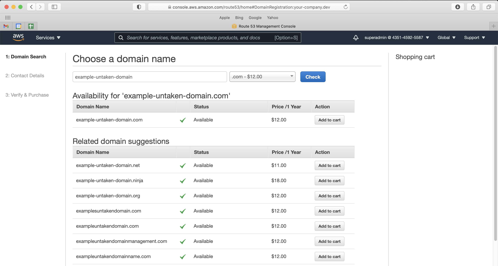
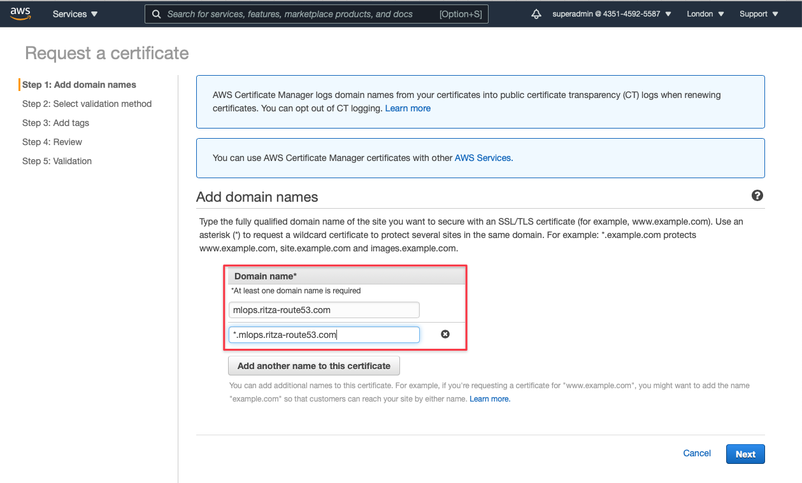
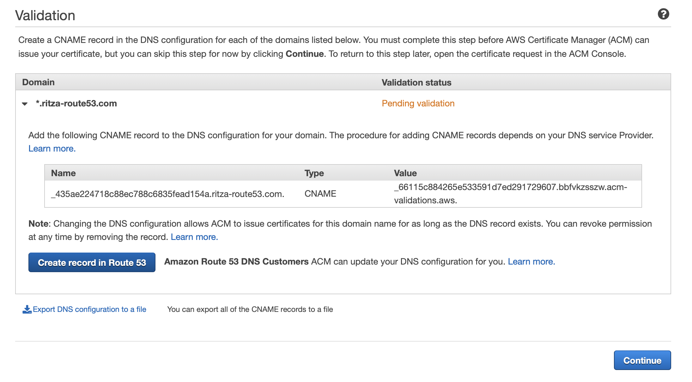
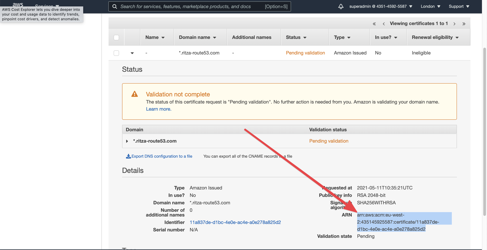
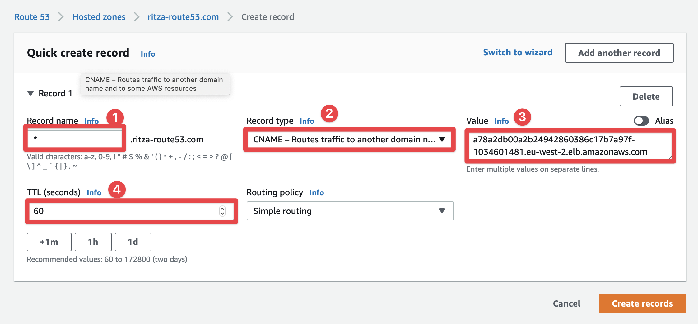

# Set up your Production Machine Learning architecture in under two hours (AWS)

*How to deploy Jupyter Hub, MLFlow, Prefect, Dask and Seldon on EKS automatically.*

You might not have had the time to set up an architecture that allows you to follow machine learning best practices. 

Many tools such as MLFlow, Prefect, and JupyterHub can help you ship models faster and more reliably, but maybe you are not sure how to set everything up, or you do not have the time to figure everything out.

We had the same problem. We spent a lot of time and solved it. Instead of solving it just for our team, we wanted to solve it for others too. We evaluated most of MLOps tools on the market, and chose the best ones that were open-source and played nicely together.

This tutorial guides you through all the scripts that will automatically set up the fully equipped MLOps infrastructure for you.

You can clone our repositories, change a few lines of configuration, run the scripts in your own AWS account, and have a replica of our **Open MLOps Architecture** running in a couple of hours.

## The result of following this guide

Once you've gone through the steps listed below, you'll have a Kubernetes cluster running on AWS EKS. This cluster will contain ready-to-go installations of 

* **Jupyter Hub** - A notebook environment to write code, train models, and do experiments.
* **MLFlow** - An experiment tracker.
* **Prefect** - A workflow and dataflow tool.
* **Seldon** - A model deployment tool to turn your model files into production APIs.
* **Dask** - to run heavy jobs in parallel on a scalable cluster of machines.


## What you need to follow this guide

To follow the steps in this guide, you need

* An AWS account, with a domain registered through Route 53.
* Some familiarity with AWS - using the web console and `awscli`. 
* Git, Terraform, Docker, Kubectl, and the AWS IAM authenticator installed locally. You can find a guide on setting up client-side dependencies [here](./install-dependencies.md)
* To be comfortable editing `yaml` configuration files.

And a little bit of patience for everything to spin up.

## Step 1: Cloning the repositories

On your local machine, create a directory called `openmlops` and clone the following three Open MLOps repositories into that directory.

```
git clone git@github.com:datarevenue-berlin/OpenMLOps.git
git clone git@github.com:datarevenue-berlin/OpenMLOps-AWS.git
git clone git@github.com:datarevenue-berlin/OpenMLOps-EKS-cluster.git
```

## Step 2: Registering and configuring your domain name and certificate

Next, you need a domain name to access all of the various services that we will install. We'll use `example.com` for this guide, but traditionally you would have something like `your-company.dev` (a different domain than the one your public-facing website or applications run on). 

 Search for a domain in the Route 53 panel and purchase it. 



Wait for the domain purchase to complete and be verified, which might take a bit. Come back tomorrow if necessary. You now have a domain and a hosted zone. You now need an SSL certificate to securely connect to your services.

Visit the **AWS Certificate Manager** and provision a new public certificate. You'll need to add two names to it

* The main subdomain, e.g. `mlops`. We'll use this for registration and account management of users. For example, your users (team) will visit `https://mlops.example.com/auth/profile/registration` to create a new account.
* All subdomains of this main subdomain. We'll be using, `prefect.mlops.example.com` to host the Prefect installation, `jupyter.mlops.example.com` for the shared notebook, etc.

Add these two patterns to the certificate (substituting the `example.com` part for your actual domain).

```
mlops.example.com
*.mlops.example.com
```

 and press "Next". Choose DNS validation (the default) when prompted and click through, accepting the defaults, of the following screens until you get to Validation.

Expand the validation section and press the "Create record in Route 53" button. This will confirm that you own the domain. 



Press "Continue" and copy the ARN of the certificate from the certificate overview page. You'll need this to configure the repositories correctly in the next step.



## Configuring the `my_vars.tfvars` file

Next you'll need to personalise the secrets and other values in the `openmlops/OpenMLOps-AWS/my_vars.tfvars` file. Many of these are self-describing, but you can find additional explanations of how to configure each in this section if you find any confusing.

* `tls_certificate_arn` - this is the full ARN of the certificate you created in the previous step.
* `aws_region` - e.g. `eu-west-2`, set this to an AWS region close to you for low latency access to the various dashboards.
* `bucket_name` - this is an S3 bucket that will be created. You need to use a name that is globally unique across all AWS users so be created (e.g. `your-company-openmlops-bucket`)
* `hostname` - the domain name you purchased in step 1, without any prefixes (e.g. `example.com`, not `https://example.com` or `www.example.com`).
* `additional_aws_users` A list of other IAM users in your AWS account that should have access. You should specify the ARN and username for each one, but you can leave the `system:masters` in the group field.
* `oauth2_providers` - this specifies how users will authenticate with the various services. The template shows how to configure GitHub. You can get the required token by navigating to [https://github.com/settings/developers](https://github.com/settings/developers) and creating a new OAuth app.
* `db_username` you can leave as is.
* `db_password` you should set a long random string, e.g. the output of `openssl rand -hex 30`
* `ory_kratos_cookie_secret` and `ory_kratos_cookie_secret` should similarly be set to (different) long random strings.
* `cluster_name`, `protocol` and `install_feast` can all be left with their default values.

## Initialising Terraform

Now change into the `OpenMLOps-AWS` directory and run `terraform init`, which will pull down the terraform dependencies that you need.

You should see "Terraform has been successfully initialized!" towards the end of the output.

### Initialising the Kubernetes secrets
Before you continue with the next steps of Terraform, you need to generate some secrets for Kubernetes. Change into the `open-mlops` repository and run the generate secrets script and then change back to the aws repository by using the following commands:

```
cd ../OpenMLOps
sh generate-secrets.sh
cd ../OpenMLOps-AWS
```

### Initialising Kubectl

Run the following in your shell to set your Kubectl config.

```
export KUBECONFIG=kubeconfig_eks-mlops
```

This will use Docker to download and configure Oathkeeper.

## Creating the Terraform plan

Terraform will spin up over 80 various services in all. Before you do this, you should check that everything is working and configured correctly. Run 

```
terraform plan -var-file=my_vars.tfvars
```

This expects a docker configuration file in ~/.docker/config.json. If you do not have this, you can create that file with `{}` as the contents and run the plan step again.

## Creating the infrastructure

Now you can run 

```
terraform apply -var-file=my_vars.tfvars
```

Note that this step will actually create the resources, including the EKS cluster in your AWS account.

Enter `yes` when prompted and wait for everything to create. You can follow along as it makes progress, or go make coffee and wait for it to finish.

## Linking your domain to the load balancer

Your services are all up and running now. They are behind a load balancer, so the last thing you need to do is set up your Hosted Zone to redirect traffic to this loadbalancer.

To get the public address of the load balancer, run.

```
kubectl get svc -n ambassador
```

And copy the long `EXTERNAL-IP` value that you see.


In the AWS Console, navigate to your hosted zone in Route 53 and click "Create Record."

Create two `CNAME` records, one for `mlops.example.com` and one for `*.mlops.example.com`, adding the public IP address you copied above as the `Value`.

Set the TTL (time to live) to 60 seconds so that you don't have to wait too long for changes to propagate, and click "Create records".


Wait a few minutes for these changes to take effect.

## Setting up a user authentication database

To create a database for user authentication, run the following command
```
kubectl exec -n ory svc/ory-kratos-admin -- kratos migrate sql -y -e -c /etc/config/kratos.yaml
```

You should see a bunch of output ending with "Successfully applied SQL migrations!". 

Now you should be ready to start using the various services.

## Trying out the services

The first step is to visit `https://mlops.example.com/auth/profile/registration` to create a new user account. Once you've done that, you can visit any of the following services

* `https://jupyter.mlops.example.com` to start writing code in your setup
* `https://prefect.mlops.example.com` to configure workflow and dataflows
* `https://mlflow.mlops.example.com` to see and track your experiments

Next, take a look at [our tutorial](./basic-usage-of-jupyter-mlflow-and-prefect.md) on creating a basic production machine learning system using the Open MLOps architecture.

